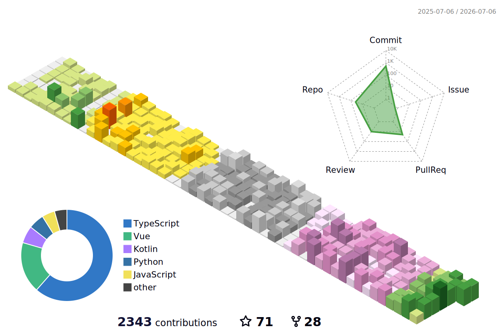

<h1 align="center">Hi, I'm HurryWang 👋</h1>

  <i>Think twice, code once.</i>

## Project
- 赛尔号信息聚合页  
  https://seerinfo.yuyuqaq.cn

## Tech Stack

### Languages

  
  
  
  

### Frameworks & Tools

  
  
  
  
  
  

## Activity

  

  

